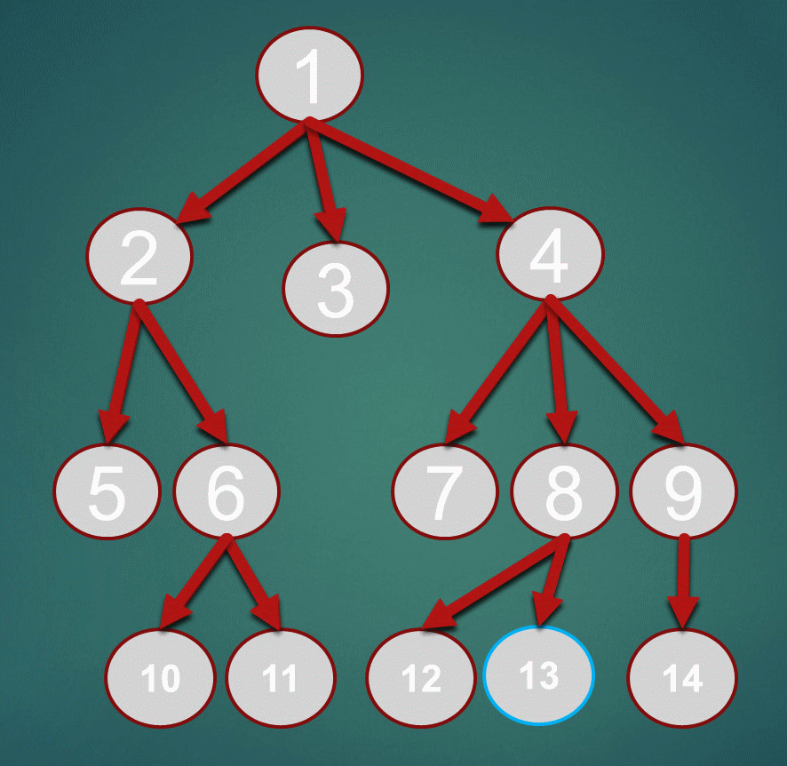

# Busca em Largura (BFS)

Demonstração da BFS no labirinto disponibilizado em sala, com visualização
gráfica e execução no terminal. Cada posição livre é um estado; os movimentos
permitidos são cima, baixo, esquerda e direita, sem atravessar paredes.

## Executar

Na pasta do projeto, instale o pygame se necessário e abra a visualização:

```bash
python -m pip install pygame
python maze.py
```

**Controles:** `R` reinicia; `+` / `-` ajustam a velocidade; `ESC` sai.

Para executar o mesmo labirinto no terminal, sem pygame:

```bash
python busca.py
```

## Arquivos

| Arquivo | Função |
|---|---|
| [`estrutura_labirinto.py`](estrutura_labirinto.py) | Mapa, início, objetivo e vizinhos permitidos. |
| [`busca.py`](busca.py) | BFS, registro dos pais e reconstrução do caminho. |
| [`maze.py`](maze.py) | Animação da busca, legenda e controles. |

## 1. Conceito Fundamental

A Busca em Largura (Breadth-First Search – BFS) é um algoritmo de exploração não informada que opera varrendo o espaço de estados em camadas.

* **Busca Não Informada (Cega):**  O algoritmo conhece estritamente o estado inicial e as regras de movimento válidas.
* **Exploração por Camadas:** Vasculha o cenário de forma sistemática por níveis de distância. Examina absolutamente todos os nós a uma distância *k* da raiz antes de avançar para qualquer nó a uma distância *k+1*.

## 2. Estrutura e Comportamento

Para garantir o mapeamento perfeito e evitar falhas de execução, o algoritmo apoia-se em três pilares:

* **Fila FIFO (First-In, First-Out):** A estrutura de dados que dita a ordem da operação. O primeiro nó a entrar na lista de espera é obrigatoriamente o primeiro a ser processado e expandido.
* **Conjunto de Visitados:** Um registro de memória com todos os estados já mapeados. É o mecanismo de segurança que impede o algoritmo de andar em círculos (*loops* infinitos) caso o grafo possua caminhos cruzados.
* **Laço de Repetição:** O ciclo lógico que mantém o algoritmo rodando. Ele repete continuamente a ação de puxar o próximo nó da Fila, verificar se é a saída e enfileirar os próximos passos possíveis.

## 3. Fluxo de Funcionamento do Método de Busca

O passo a passo lógico do BFS divide-se em quatro etapas. O primeiro passo serve apenas para preparar o terreno, enquanto o **funcionamento ativo (o ciclo contínuo do algoritmo)** começa realmente a partir da segunda etapa:

1. **Inicialização (Preparação):** Insere o nó de origem (raiz) na fila FIFO e já o marca como "visitado".
2. **Iteração (Início do Motor/Loop):** Remove o nó que está na frente da fila e aplica o teste de meta para verificar se ele é o objetivo final.
3. **Expansão:** Se o nó atual não for a meta, o algoritmo mapeia todos os seus sucessores válidos (os próximos passos possíveis) que ainda não constam no conjunto de visitados.
4. **Enfileiramento:** Coloca estes novos nós no final da fila FIFO e repete o ciclo voltando obrigatoriamente para o passo 2, até que a meta seja encontrada.

<p align="center"></p>

**Aplicação:** Um exemplo da aplicação desse método de busca é a lógica de sugestão de amizades em redes sociais, como o LinkedIn ou o Facebook. 

**Vantagem:** Garante encontrar o caminho com o menor número de movimentos.
**Limitação:** É o consumo exponencial de memória RAM, pois a obrigação de guardar todas as ramificações abertas em simultâneo pode esgotar o sistema em mapas muito grandes.

## Resultado do mapa atual

A busca examina **161 células** e encontra um caminho de **32 movimentos**,
passando por **33 células**, incluindo o início. Células examinadas incluem
alternativas que não fazem parte da solução; movimentos são os deslocamentos
do caminho final, calculados por `len(caminho) - 1`.


